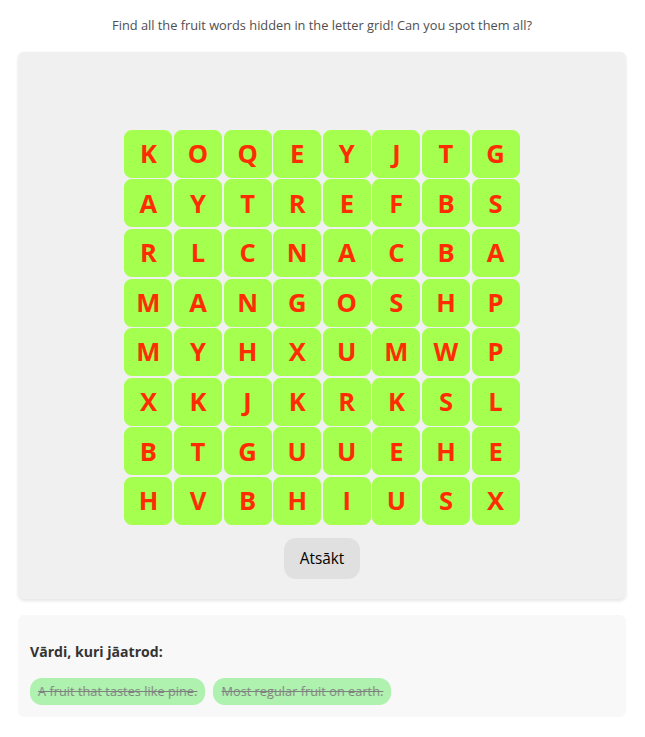

# adapt-wordGame

**Word Game** is a component for the Adapt Framework. It presents learners with an interactive word search puzzle where they can find and select hidden words in a grid of letters.



## Installation

Download the ZIP and extract into the src > components directory, then run `grunt build`.

## Settings Overview

The attributes listed below are used in *components.json* to configure **Word Game**, and are properly formatted as JSON in [*example.json*](example.json).

### Attributes

**\_wordgame** (object): The Word Game component object that contains settings for the component.

>**title** (string): The title text that appears above the component.

>**displayTitle** (string): The title that appears in the component header.

>**body** (string): The instructional text.

>**instruction** (string): Specific guidance text for the game.

>**\_grid** (object): Settings for the word search grid.
>>**\_rows** (number): Number of rows in the grid.  
>>**\_columns** (number): Number of columns in the grid.

>**\_words** (array): Contains objects defining each word to be found.
>>**text** (string): The word to be found.  
>>**description** (string): Optional description or hint for the word.  
>>**\_points** (number): Points awarded for finding this word.

>**\_feedback** (object): Various feedback messages.
>>**correct** (string): Message when a word is found.  
>>**incorrect** (string): Message when an invalid selection is made.  
>>**complete** (string): Message when all words are found.

>**\_isEnabled** (boolean): Enables/disables this component.

>**\_isSubmitted** (boolean): Indicates if the component has been submitted.

### Example Configuration

```json
{
    "_id": "c-05",
    "_parentId": "b-05",
    "_type": "component",
    "_component": "wordgame",
    "_classes": "",
    "_layout": "full",
    "_wordgame": {
        "title": "Word Search Game",
        "displayTitle": "Find the Hidden Words",
        "body": "Find all the hidden words related to workplace safety.",
        "instruction": "Click and drag to select letters that form words from the list.",
        "_grid": {
            "_rows": 10,
            "_columns": 10
        },
        "_words": [
            {
                "text": "SAFETY",
                "description": "The condition of being protected",
                "_points": 10
            },
            {
                "text": "HAZARD",
                "description": "A potential source of danger",
                "_points": 10
            }
        ],
        "_feedback": {
            "correct": "Well done! You found a word!",
            "incorrect": "Keep trying!",
            "complete": "Congratulations! You've found all the words!"
        },
        "_isEnabled": true,
        "_isSubmitted": false
    }
}
```

## Limitations

- Currently supports horizontal and vertical word placement only
- Words must be at least 2 characters long
- Grid size limited to 15x15 maximum

## Browser Spec

This component has been tested to the standard Adapt browser specification.

## Dependencies

- Adapt Framework >= 5.39.6
- adapt-contrib-core >= 5.19.1

## Known Issues

None.

---

**Author / Maintainer:** Ambax@Digify arturs@digify.lv  
**License:** [MIT](LICENSE)  
**Targeted Framework Version:** >= 5.39.6  
**Repository:** [https://github.com/ambivalent-axiom/adapt-wordGame](https://github.com/ambivalent-axiom/adapt-wordGame)