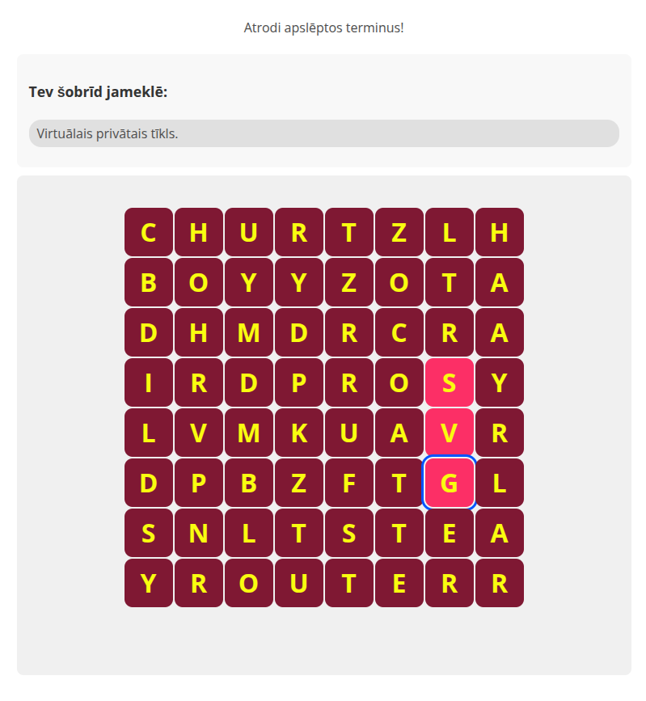

# adapt-wordGame

A word search game component for the Adapt framework. Players search for hidden words in a grid of letters, with customizable themes, hints, and feedback options.



## Features

- Configurable grid size (6x6 to 12x12)
- Customizable word list with hints
- Optional decoy words
- Responsive design suitable for all devices
- Customizable color themes
- Sound effects for interactions
- SCORM assessment integration
- Custom feedback modal
- Accessibility support
- Multiple word placement directions (horizontal, vertical, diagonal)

## Installation

Download the component using the Adapt CLI:

```bash
adapt install adapt-wordGame
```

## Settings Overview

**Component JSON Configuration**

```json
{
    "_id": "c-05",
    "_parentId": "b-05",
    "_type": "component",
    "_component": "wordgame",
    "_classes": "",
    "_layout": "full-width",
    "title": "Word Search Game",
    "displayTitle": "Find the Words!",
    "titleDescription": "Find the hidden words",
    "startText": "Start Game",
    "description": "Find all the hidden words in the grid!",
    "wordsToFindText": "Words to find:",
    "_supportedLayout": "full-width",
    "maxWordsPerGame": 2,
    "gridSize": 8,
    "_assessment": {
        "_isEnabled": true,
        "_shouldSubmitScore": true
    }
}
```

### Core Settings

| Attribute              | Type    | Description                                               |
|-----------------------|---------|-----------------------------------------------------------|
| `_component`          | String  | Must be "wordgame"                                        |
| `_layout`             | String  | "full-width" (recommended) or "half-width"                |
| `title`               | String  | The title shown in the component                          |
| `displayTitle`        | String  | Title shown before game starts                            |
| `titleDescription`    | String  | Description shown before game starts                      |
| `startText`           | String  | Text for the start button                                 |
| `maxWordsPerGame`     | Number  | Number of words randomly selected for each game           |
| `gridSize`            | Number  | Size of the grid (6-12)                                  |

### Theme Settings

```json
"_wordgame": {
    "theme": {
        "primary": "#73c855",
        "secondary": "#b7eaad",
        "wrong": "#d90ae8",
        "text": "#182a12",
        "wrongText": "#e8e8e8",
        "word": "#333"
    }
}
```

| Color       | Description                                    |
|-------------|------------------------------------------------|
| primary     | Background color for letter cells              |
| secondary   | Background for selected/found letters          |
| wrong       | Background for incorrect selections            |
| text        | Letter color                                   |
| wrongText   | Letter color for incorrect selections          |
| word        | Color for hint text                           |

### Word Configuration

```json
"_wordgame": {
    "words": [
        {
            "text": "APPLE",
            "hint": "Most regular fruit on earth"
        }
    ],
    "decoys": [
        {
            "text": "CAR"
        }
    ]
}
```

### Audio Settings

```json
{
    "onClickSound": "course/en/assets/click.mp3",
    "onCorrectSound": "course/en/assets/correct.mp3",
    "onWrongSound": "course/en/assets/wrong.mp3",
    "onFinishSound": "course/en/assets/finished.mp3"
}
```

## Limitations

- Grid size must be between 6 and 12 to ensure playability on mobile devices
- Words must fit within the grid size
- For optimal performance, limit total words (including decoys) based on grid size
- All words must be in CAPITAL letters

## Dependencies

- Adapt Framework >= 5.39.6
- adapt-contrib-core >= 5.19.1

## License

Licensed under the [MIT License](LICENSE)

## Acknowledgements

Developed by [Ambax@Digify](mailto:arturs@digify.lv)